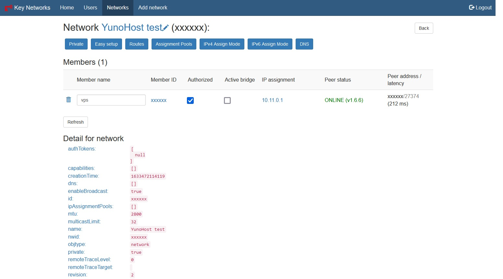

<!--
N.B.: This README was automatically generated by https://github.com/YunoHost/apps/tree/master/tools/README-generator
It shall NOT be edited by hand.
-->

# Zerotier UI pour YunoHost

[](https://dash.yunohost.org/appci/app/ztncui)  

[](https://install-app.yunohost.org/?app=ztncui)

*[Read this readme in english.](./README.md)*

> *Ce package vous permet d’installer Zerotier UI rapidement et simplement sur un serveur YunoHost.
Si vous n’avez pas YunoHost, regardez [ici](https://yunohost.org/#/install) pour savoir comment l’installer et en profiter.*

## Vue d’ensemble

ztncui is a web user interface for a standalone ZeroTier network controller.
It allows you to take control of your own ZeroTier network without relying on the publisher's cloud-based controller.


**Version incluse :** 20230311~ynh1

## Captures d’écran



## Avertissements / informations importantes

### Dependency

* [ZeroTier for YunoHost](https://github.com/YunoHost-Apps/zerotier_ynh) has to be installed beforehand.

### Multi-users support

 * LDAP and HTTP auth are not supported.
 * Multiple users can use the app, you have to add them manually in `/opt/key-networks/ztncui/src/etc/passwd`, see ztncui's documentation.

## :red_circle: Fonctions indésirables

- **Non-free dependencies**: Relies on software dependencies that are not free in order to run.

## Documentations et ressources

* Site officiel de l’app : <https://key-networks.com/ztncui/>
* Dépôt de code officiel de l’app : <https://github.com/key-networks/ztncui>
* YunoHost Store: <https://apps.yunohost.org/app/ztncui>
* Signaler un bug : <https://github.com/YunoHost-Apps/ztncui_ynh/issues>

## Informations pour les développeurs

Merci de faire vos pull request sur la [branche testing](https://github.com/YunoHost-Apps/ztncui_ynh/tree/testing).

Pour essayer la branche testing, procédez comme suit.

``` bash
sudo yunohost app install https://github.com/YunoHost-Apps/ztncui_ynh/tree/testing --debug
ou
sudo yunohost app upgrade ztncui -u https://github.com/YunoHost-Apps/ztncui_ynh/tree/testing --debug
```

**Plus d’infos sur le packaging d’applications :** <https://yunohost.org/packaging_apps>